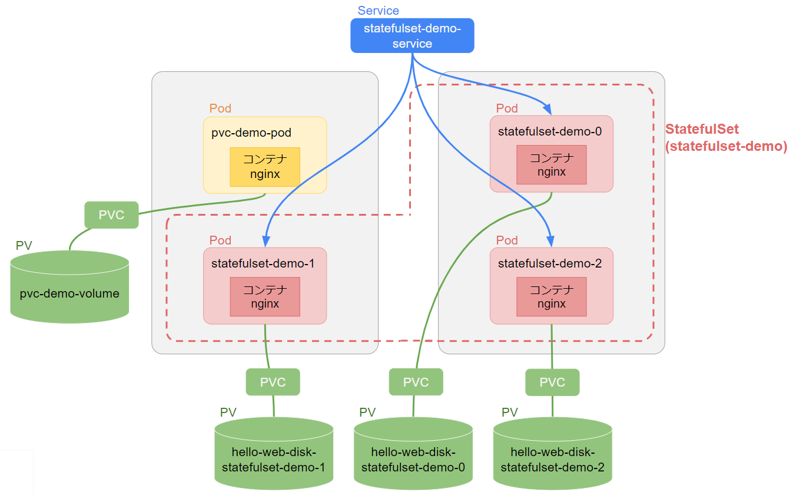
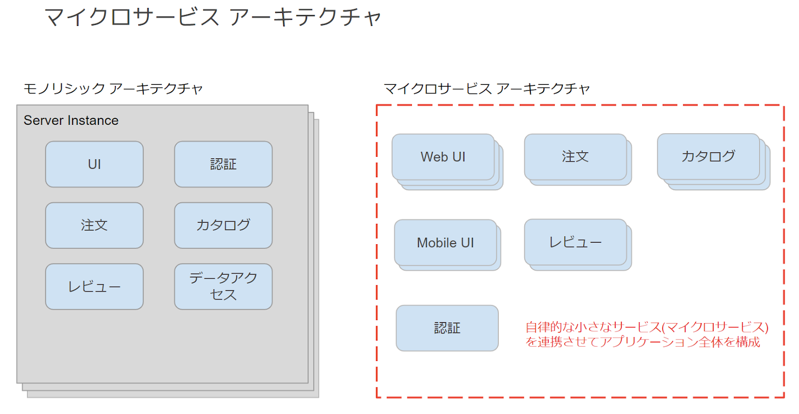

# Instruction

- <a href="https://qualia906.github.io/gcp-training-prep/registration/" target=_blank>Qwiklabs アカウント作成手順</a>
    
- <a href="https://qualia906.github.io/gcp-training-prep/how-to-use-lab/" target=_blank>ラボの開始手順</a>
    
 
  

# ラボの注意点

  

## Lab：Google Kubernetes Engine Deployment を作成する

- このラボでは、[ラボを開始] 時に GKE クラスタが自動で作成されます。  
    「ラボ用のリソースをプロビジョニングしています」の表示が消えてから Cloud Console にアクセスしてください。
    
- タスク 2 の「Console で Pod をスケールアウトまたはスケールインする」の手順 4 では、[**ACTIONS**] > [**スケール**] > [**レプリカを編集**] をクリックしてください。
    
 
 
## Lab：Google Kubernetes Engine 用に永続ストレージを構成する

- このラボでは、[ラボを開始] 時に GKE クラスタが自動で作成されます。
    

   

# Reference

### Docker

-   [Docker - Reference Documentation](https://docs.docker.com/reference/)    

-   [Where are Docker Images Stored? Docker Container Paths Explained](https://www.freecodecamp.org/news/where-are-docker-images-stored-docker-container-paths-explained/)
-   [Dockerfile のベストプラクティスとセキュリティについて](https://tech.enigmo.co.jp/entry/2020/12/17/100000)
    
-   [Buildpacks](https://buildpacks.io/)
    
-   [ベストなイメージが作成可能な Cloud Native Buildpacks の使い方](https://logmi.jp/tech/articles/324447)
    
-   [マルチステージビルドの利用](https://matsuand.github.io/docs.docker.jp.onthefly/develop/develop-images/multistage-build/)
    
-   [マルチステージビルドを使う](https://docs.docker.jp/develop/develop-images/multistage-build.html)
    

### Cloud Build

-   [Cloud Build の概要](https://cloud.google.com/build/docs/overview?hl=ja)
    
-   [クラウドビルダー](https://cloud.google.com/build/docs/cloud-builders?hl=ja)
    
-   [Cloud Builders Community](https://github.com/GoogleCloudPlatform/cloud-builders-community)
    

### Google Cloud のコンピューティング プロダクト

-   [アプリケーションはどこで動かすべきか、それが問題だ](https://services.google.com/fh/files/events/d2-appdev-04.pdf)
    
-   [アプリケーションのホスティングのオプション](https://cloud.google.com/hosting-options?hl=ja)
    

### GKE/Kubernetes

-   [標準化用語集](https://kubernetes.io/ja/docs/reference/glossary/?fundamental=true)
    
-   [kubectl チートシート](https://kubernetes.io/ja/docs/reference/kubectl/cheatsheet/)
    
-   [コンセプト (オブジェクト/コントロールプレーン)](https://kubernetes.io/ja/docs/concepts/)
    
-   [Kubernetes オブジェクトを理解する](https://kubernetes.io/ja/docs/concepts/overview/working-with-objects/kubernetes-objects/)
    
-   [コントローラー](https://kubernetes.io/ja/docs/concepts/architecture/controller/)
    
-   [Kubernetes を拡張しよう](https://www.ianlewis.org/jp/extending-kubernetes-ja)
    
-   [Kubernetes のスケジューラー](https://kubernetes.io/ja/docs/concepts/scheduling-eviction/kube-scheduler/)
    

  

-   [Pod のライフサイクル](https://kubernetes.io/ja/docs/concepts/workloads/pods/pod-lifecycle/)
    
-   リソース配分
    

     -   [LimitRange](https://kubernetes.io/ja/docs/concepts/policy/limit-range/)
    
     -   [RecourceQuota](https://kubernetes.io/ja/docs/concepts/policy/resource-quotas/)
    

  

-   [Deployment](https://kubernetes.io/ja/docs/concepts/workloads/controllers/deployment/)
    
-   [Deployment: ステータスとライフサイクル](https://cloud.google.com/kubernetes-engine/docs/concepts/deployment#status_and_lifecycle) (GKE)
    
-   [Horizontal Pod Autoscaler](https://kubernetes.io/docs/tasks/run-application/horizontal-pod-autoscale/)
    

-   [Horizontal Pod Autoscaler(HPA) based on CPU and Memory](https://medium.com/faun/kubernetes-horizontal-pod-autoscaler-hpa-bb789b3070e4)
    
-   Understanding kubernetes networking: [Pods](https://medium.com/google-cloud/understanding-kubernetes-networking-pods-7117dd28727#id_token=eyJhbGciOiJSUzI1NiIsImtpZCI6ImQ0Y2JhMjVlNTYzNjYwYTkwMDlkODIwYTFjMDIwMjIwNzA1NzRlODIiLCJ0eXAiOiJKV1QifQ.eyJpc3MiOiJodHRwczovL2FjY291bnRzLmdvb2dsZS5jb20iLCJuYmYiOjE2MDc1Njk4NjAsImF1ZCI6IjIxNjI5NjAzNTgzNC1rMWs2cWUwNjBzMnRwMmEyamFtNGxqZGNtczAwc3R0Zy5hcHBzLmdvb2dsZXVzZXJjb250ZW50LmNvbSIsInN1YiI6IjEwMTY3MDYwNTUzNTM2NTIwNjUyMyIsImVtYWlsIjoia29nYS5tYXNhdG9AdHJhaW5vY2F0ZS5jb20iLCJlbWFpbF92ZXJpZmllZCI6dHJ1ZSwiYXpwIjoiMjE2Mjk2MDM1ODM0LWsxazZxZTA2MHMydHAyYTJqYW00bGpkY21zMDBzdHRnLmFwcHMuZ29vZ2xldXNlcmNvbnRlbnQuY29tIiwibmFtZSI6Ik1hc2F0byBLb2dhIiwicGljdHVyZSI6Imh0dHBzOi8vbGgzLmdvb2dsZXVzZXJjb250ZW50LmNvbS9hLS9BT2gxNEdqc0x5bWRHT0dCQVdoX1JSUm5VeFBSZVlOSXNmbVJ4azZISVRTMG53PXM5Ni1jIiwiZ2l2ZW5fbmFtZSI6Ik1hc2F0byIsImZhbWlseV9uYW1lIjoiS29nYSIsImlhdCI6MTYwNzU3MDE2MCwiZXhwIjoxNjA3NTczNzYwLCJqdGkiOiI2ZGIyZWViNzc1MzI3OWEzZGRhYmY3NDU1MjRhY2VlZGQ4NTdjZjlhIn0.fYCpsaecpEuMwDIVLPoPRDH66_qAYntukKTHuBsBoRuD1EuhE2KChhiFNklWJDeV9NJ62gUyzkx5choqG7z1fMX73fOw0njuK93HZiTMeNqyhkCwfsKCoyIRMbyqAW_8Bw6ACvmglYnZx6Jcc-CaAuzb988AJxqpEUpHnTrE6tJu42XuNLkQtCSpdn-HDDEjpU71shC7zwSylut3wnKTmWh_1HoBBnfnt3k0IBzcaCsZntSXMbpjgvFpGSukF0zGsm82KHKVrVTiKV7BOFWa4ojxlocPdeupB8vaacsxg30YEwIuJ9yplGTmBJyECg42Y_IFZjIDFhj9qOmJ_zPR5w), [Services](https://medium.com/google-cloud/understanding-kubernetes-networking-services-f0cb48e4cc82), [Ingress](https://medium.com/google-cloud/understanding-kubernetes-networking-ingress-1bc341c84078)
    
-   [Service](https://kubernetes.io/ja/docs/concepts/services-networking/service/)
    
-   [ServiceとPodに対するDNS](https://kubernetes.io/ja/docs/concepts/services-networking/dns-pod-service/)
    
-   [Istio](https://istio.io/)
    
     -   [What is Istio?](https://istio.io/latest/docs/concepts/what-is-istio/)
    
     -   [Istio 導入への道](https://blog.1q77.com/category/kubernetes/istio/)
    

-   [Ingress](https://kubernetes.io/ja/docs/concepts/services-networking/ingress/)
    
     -   [Ingress コントローラー](https://kubernetes.io/ja/docs/concepts/services-networking/ingress-controllers/)
    
     -   [Ingress 機能の構成](https://cloud.google.com/kubernetes-engine/docs/how-to/ingress-features)
    

-   ネットワーク エンドポイント グループ (NEG)
    

     -   [概要](https://cloud.google.com/load-balancing/docs/negs)
    
     -   [Ingress によるコンテナ ネイティブの負荷分散](https://cloud.google.com/kubernetes-engine/docs/how-to/container-native-load-balancing)
    
     -   [Container-native load balancing on GKE now generally available (NEG)](https://cloud.google.com/blog/products/containers-kubernetes/container-native-load-balancing-on-gke-now-generally-available)
    
     -   [Introducing container-native load balancing on Google Kubernetes Engine](https://cloud.google.com/blog/products/containers-kubernetes/introducing-container-native-load-balancing-on-google-kubernetes-engine)
    

  
  
  
  

-   [ストレージの概要](https://cloud.google.com/kubernetes-engine/docs/concepts/storage-overview) (GKE)
    

     -   [Volume](https://cloud.google.com/kubernetes-engine/docs/concepts/volumes)
    
-   [永続ボリュームと動的プロビジョニング](https://cloud.google.com/kubernetes-engine/docs/concepts/persistent-volumes)
    
-   [Google Kubernetes Engine クラスタからのファイル共有へのアクセス](https://cloud.google.com/filestore/docs/accessing-fileshares)
    

-   [Volumes](https://kubernetes.io/docs/concepts/storage/volumes/)
    

-   [ストレージにボリュームを使用するPodを構成する](https://kubernetes.io/ja/docs/tasks/configure-pod-container/configure-volume-storage/)
    

-   [永続ボリューム](https://kubernetes.io/ja/docs/concepts/storage/persistent-volumes/)
    
-   [Storage Classes](https://kubernetes.io/docs/concepts/storage/storage-classes/)
    
-   [Expose Pod Information to Containers Through Files](https://kubernetes.io/docs/tasks/inject-data-application/downward-api-volume-expose-pod-information/)
    

  

-   [StatefulSet](https://kubernetes.io/ja/docs/concepts/workloads/controllers/statefulset/)
    
     -   [StatefulSet の基本](https://kubernetes.io/ja/docs/tutorials/stateful-application/basic-stateful-set/)
    
     -   [Stateful Applications on Kubernetes](https://akomljen.com/stateful-applications-on-kubernetes/)
    

### Anthos

-   [[Cloud OnAir] 解説を聞きながら Anthos を体験しよう](https://www.slideshare.net/GoogleCloudPlatformJP/cloud-onair-anthos-anthos-2020115)
    
-   [Deep-dive into Anthos on GCP](https://inthecloud.withgoogle.com/anthos-day-2001/Google_Cloud_Anthos_Day_200130_Session2.pdf)
    
-   [Anthos technical overview](https://cloud.google.com/anthos/docs/concepts/overview)
    
-   Migrate for Anthos and GKE
    
     -   [Migrate for Anthos and GKE を設定する](https://cloud.google.com/migrate/anthos/docs/setting-up-overview?hl=ja)
    
     -   [ワークロードをコンテナに移行する方法の概要](https://cloud.google.com/migrate/anthos/docs/getting-started?hl=ja)
    

  

### CI/CD

-   [CIOpsとGitOpsの話](https://blog.inductor.me/entry/2021/09/24/015402)
    
 
  

# 補足スライド

  

